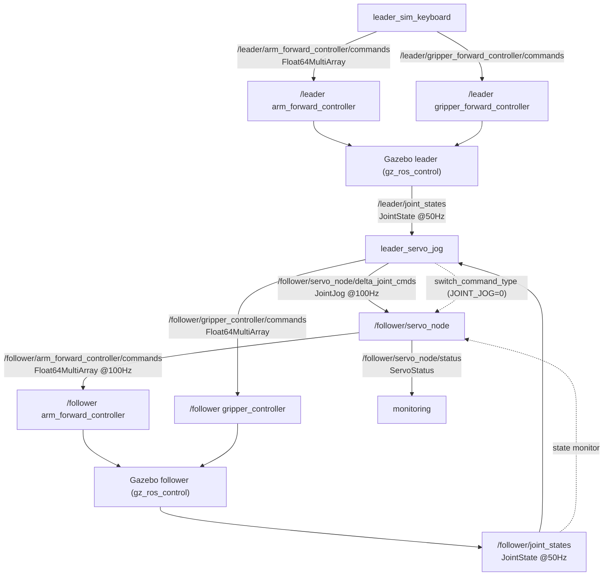
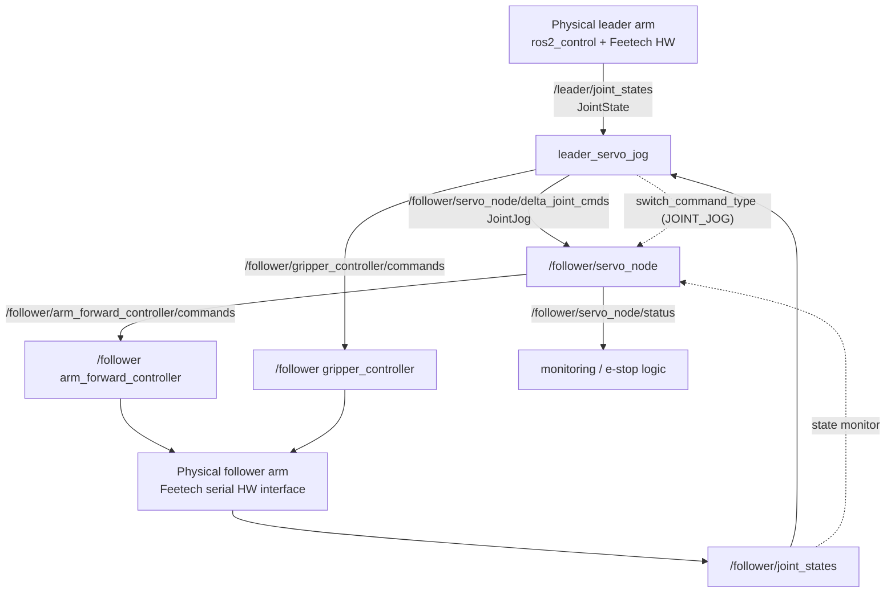
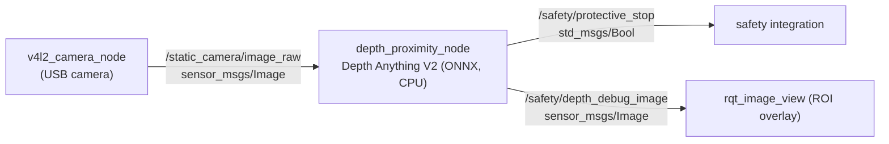
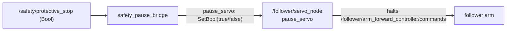
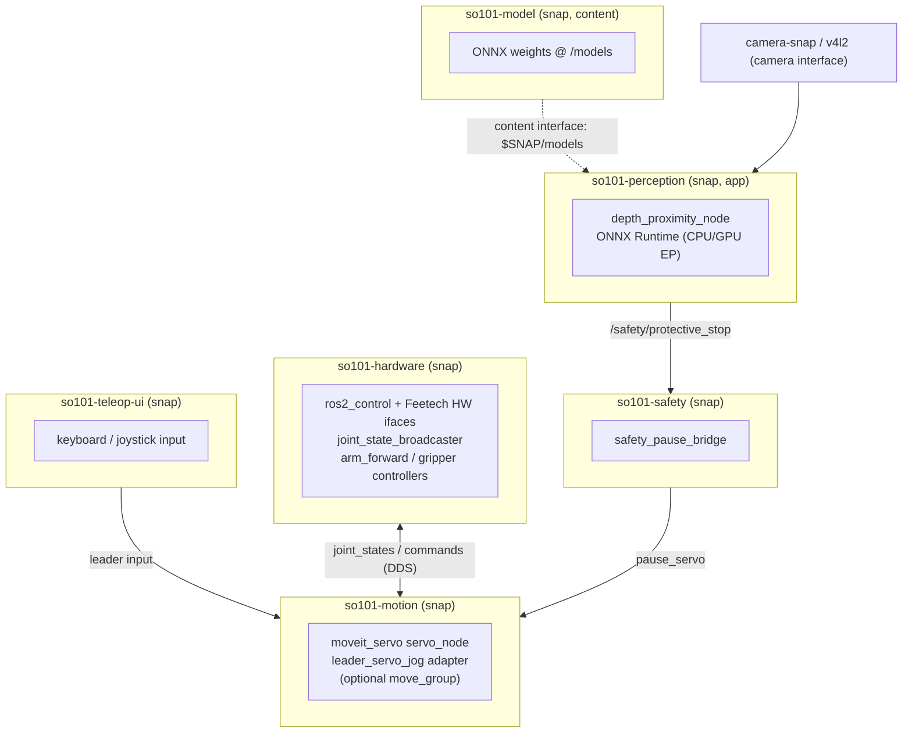

# SO-101 — ROS 2 Communication, Safety & Production Architecture

Design reference for the MoveIt Servo teleoperation stack, the depth-based
obstacle-avoidance (protective-stop) subsystem, and a production-ready snap
packaging with a swappable AI perception model.

Scope covered:

1. [Overview](#1-overview)
2. [Node & component inventory](#2-node--component-inventory)
3. [ROS 2 communication map — Simulation](#3-ros-2-communication-map--simulation)
4. [ROS 2 communication map — Real hardware](#4-ros-2-communication-map--real-hardware)
5. [Obstacle avoidance / protective-stop subsystem](#5-obstacle-avoidance--protective-stop-subsystem)
6. [Sim vs real: what changes](#6-sim-vs-real-what-changes)
7. [Production architecture (snaps) & swappable AI model](#7-production-architecture-snaps--swappable-ai-model)

---

## 1. Overview

The follower arm is teleoperated **through MoveIt Servo** rather than by direct
joint copy. A leader arm (physical, or the Gazebo sim leader driven by a
keyboard) publishes joint states; an adapter converts leader/follower joint
error into `control_msgs/JointJog` velocity commands; Servo turns those into a
collision-, singularity- and joint-limit-safe position stream to the follower's
`arm_forward_controller`.

A separate **perception subsystem** runs a monocular depth model (Depth Anything
V2 Small, ONNX Runtime, CPU) on a camera feed and raises a boolean
**protective-stop** signal when an object gets too close. Motion is halted while
the stop is asserted.

Design principles:

- **Single writer** to any controller command interface.
- **Namespaced** per arm (`/leader`, `/follower`) so the same nodes scale to
  multi-arm setups.
- **Stable topic contract** between perception, safety and motion so the AI
  model is replaceable without touching the motion stack.
- **Identical topic names/types** in simulation and on real hardware — only the
  bottom (hardware execution) layer changes.

---

## 2. Node & component inventory

| Component | Package | Executable | Role |
|---|---|---|---|
| Leader keyboard (sim) | `so101_teleop` | `leader_sim_keyboard` | Operator input → drives sim leader arm. Omitted on real HW. |
| **Servo adapter** | `so101_teleop` | `leader_servo_jog` | Leader/follower joint error → `JointJog`; gripper passthrough; switches Servo to `JOINT_JOG`. |
| MoveIt Servo | `moveit_servo` | `servo_node` | `JointJog`/`Twist`/`Pose` → safe position stream + status. |
| Safety gate (JTC path) | `so101_teleop` | `trajectory_safety_gate` | Blocks/holds JointTrajectory stream on protective-stop. |
| Depth proximity | `so101_depth_demo` | `depth_proximity_node` | Camera image → depth → `Bool` protective-stop + debug overlay. |
| Depth viz (demo) | `so101_depth_demo` | `depth_anything_node` | Camera image → colorised depth image (visualisation only). |
| Controllers | `controller_manager` | `ros2_control_node` / `gz_ros_control` | Execute commands, publish joint states. |

Legacy (retired on the Servo path): `teleop_split` (direct joint-copy bridge).
It must **not** run alongside Servo — both would write the follower position
interface.

---

## 3. ROS 2 communication map — Simulation

Simulation runs a **leader + follower pair** in Gazebo (`ros_gz_sim` +
`gz_ros_control`), a shared `/clock`, and `use_sim_time:=true` everywhere.

Launch composition:

```
ros2 launch so101_bringup gazebo_teleop_sim.launch.py \
     launch_teleop:=false launch_keyboard:=false \
     follower_arm_controller:=arm_forward_controller
ros2 launch so101_moveit_config servo.launch.py use_sim_time:=true
ros2 launch so101_teleop teleop_servo.launch.py            # adapter + leader keyboard
```

### 3.1 Teleop data flow (sim)



### 3.2 Topic table (sim)

| Topic | Type | Publisher | Subscriber(s) | Rate |
|---|---|---|---|---|
| `/leader/arm_forward_controller/commands` | `std_msgs/Float64MultiArray` | `leader_sim_keyboard` | `/leader` arm ctrl | 50 Hz |
| `/leader/gripper_forward_controller/commands` | `std_msgs/Float64MultiArray` | `leader_sim_keyboard` | `/leader` gripper ctrl | 50 Hz |
| `/leader/joint_states` | `sensor_msgs/JointState` | `/leader/joint_state_broadcaster` | `leader_servo_jog` | 50 Hz |
| `/follower/joint_states` | `sensor_msgs/JointState` | `/follower/joint_state_broadcaster` | `leader_servo_jog`, `servo_node` | 50 Hz |
| `/follower/servo_node/delta_joint_cmds` | `control_msgs/JointJog` | `leader_servo_jog` | `servo_node` | 100 Hz |
| `/follower/arm_forward_controller/commands` | `std_msgs/Float64MultiArray` | `servo_node` | `/follower` arm ctrl | 100 Hz |
| `/follower/gripper_controller/commands` | `std_msgs/Float64MultiArray` | `leader_servo_jog` | `/follower` gripper ctrl | on-change |
| `/follower/servo_node/status` | `moveit_msgs/ServoStatus` | `servo_node` | monitoring | on-change |
| `/clock` | `rosgraph_msgs/Clock` | `ros_gz_bridge` | all (`use_sim_time`) | sim |
| `/tf`, `/tf_static` | `tf2_msgs/TFMessage` | both `robot_state_publisher` | Servo, RViz | — |

Arm array joint order: `[shoulder_pan, shoulder_lift, elbow_flex, wrist_flex, wrist_roll]`; gripper: `[gripper]`.

### 3.3 Services (sim & real, identical)

| Service | Type | Server | Client | Purpose |
|---|---|---|---|---|
| `/follower/servo_node/switch_command_type` | `moveit_msgs/srv/ServoCommandType` | `servo_node` | `leader_servo_jog` | Input mode. **`JOINT_JOG=0`**, `TWIST=1`, `POSE=2`. |
| `/follower/servo_node/pause_servo` | `std_srvs/srv/SetBool` | `servo_node` | safety bridge (§5) | Pause/resume Servo output. |
| `/follower/controller_manager/switch_controller` | `controller_manager_msgs/srv/SwitchController` | `controller_manager` | bringup | Activate `arm_forward_controller`. |

---

## 4. ROS 2 communication map — Real hardware

On real hardware the **motion contract is unchanged**. Differences:

- The leader is a **physical arm** publishing `/leader/joint_states` directly
  (via its own `ros2_control` hardware interface + `joint_state_broadcaster`).
  No `leader_sim_keyboard`, no Gazebo, **no `/clock`** (`use_sim_time:=false`).
- The follower is a **physical arm**; `gz_ros_control` is replaced by the
  Feetech serial hardware interface (`feetech_ros2_driver`).

Launch composition:

```
# Leader (publishes /leader/joint_states from the physical arm)
ros2 launch so101_bringup leader.launch.py hardware_type:=real usb_port:=/dev/so101_leader
# Follower on the position controller Servo drives
ros2 launch so101_bringup follower_split.launch.py \
     hardware_type:=real usb_port:=/dev/so101_follower \
     arm_controller:=arm_forward_controller
# Servo + adapter (no sim time)
ros2 launch so101_moveit_config servo.launch.py
ros2 launch so101_teleop teleop_servo.launch.py use_sim_time:=false launch_keyboard:=false
```

### 4.1 Teleop data flow (real)



### 4.2 Delta vs simulation

| Aspect | Simulation | Real hardware |
|---|---|---|
| Leader source | `leader_sim_keyboard` → Gazebo leader | Physical leader arm |
| Follower execution | `gz_ros_control` | `feetech_ros2_driver` hardware interface |
| Time | `/clock`, `use_sim_time:=true` | System clock, `use_sim_time:=false` |
| `/leader/*_controller/commands` | present (drive sim leader) | absent (leader is backdriven/read-only) |
| Device access | none | serial/USB (`/dev/so101_leader`, `/dev/so101_follower`) |
| Everything else (topics/types) | **identical** | **identical** |

---

## 5. Obstacle avoidance / protective-stop subsystem

Perception is **the same on sim and real** — it is always a real camera (or a
synthetic publisher in a headless container) plus a CPU model. Only *how the
stop halts the arm* differs by motion path.

### 5.1 Perception → safety signal



`depth_proximity_node` logic: run monocular depth, compare a center ROI against
the surrounding background depth; if the ROI is clearly *nearer* than the scene
over `frames_to_block` consecutive frames, assert `True`; release after
`frames_to_clear` clear frames (hysteresis). Depth Anything gives *relative*
depth, so triggering is relative-to-background, not an absolute distance.

### 5.2 Perception topics & key parameters

| Topic | Type | Dir | Notes |
|---|---|---|---|
| `<input_image_topic>` (e.g. `/static_camera/image_raw`) | `sensor_msgs/Image` | in | rgb8/bgr8/mono8 |
| `/safety/protective_stop` | `std_msgs/Bool` | out | `True` = stop requested |
| `/safety/depth_debug_image` | `sensor_msgs/Image` | out | colorised depth + ROI (red=STOP, green=clear) |

| Parameter | Default | Meaning |
|---|---|---|
| `model_path` | `~/models/depth_anything_v2_small.onnx` | **AI model swap point** (any Depth Anything V2 ONNX) |
| `roi` | `0.25,0.2,0.75,0.85` | normalised center region checked |
| `near_margin` | `0.15` | how much nearer than background counts as "near" |
| `min_area_ratio` | `0.12` | fraction of ROI near → candidate stop |
| `frames_to_block` / `frames_to_clear` | `2` / `3` | hysteresis |
| `inference_hz` | `10.0` | CPU throttle |
| `intra_op_threads` | `0` | ONNX Runtime threads (0 = default) |

### 5.3 Two ways to halt the arm

**A. JointTrajectory path (existing, JTC-based) — `trajectory_safety_gate`.**
An in-line gate sits between a teleop bridge and the JTC. It forwards
trajectories only while clear; on stop it blocks the stream and publishes a
*hold* trajectory (current follower positions) so the arm freezes in place.

| Topic | Type | Dir |
|---|---|---|
| `/safety/follower/arm_trajectory_in` | `trajectory_msgs/JointTrajectory` | in (from teleop) |
| `/safety/protective_stop` | `std_msgs/Bool` | in (gate condition) |
| `/follower/joint_states` | `sensor_msgs/JointState` | in (hold pose) |
| `/follower/arm_trajectory_controller/joint_trajectory` | `trajectory_msgs/JointTrajectory` | out (to JTC) |

This path requires the **JTC** (`arm_trajectory_controller`) and does **not**
apply to the Servo path.

**B. Servo path (recommended with this stack) — `pause_servo`.**
Servo already owns the follower and stops smoothly. A tiny bridge subscribes
`/safety/protective_stop` and calls the Servo pause service — no trajectory
interception needed:



| Interface | Type | Notes |
|---|---|---|
| `/safety/protective_stop` | `std_msgs/Bool` | in |
| `/follower/servo_node/pause_servo` | `std_srvs/srv/SetBool` | out (call `true` on stop, `false` on clear) |

> Implementation note: this bridge is ~30 lines (Bool sub → SetBool client with
> edge detection) and can live in `so101_teleop`, or be folded into
> `leader_servo_jog` as an optional feature. It is the clean, Servo-native
> replacement for `trajectory_safety_gate` on the forward-controller path.

### 5.4 Running the demo

- **Sim (arm simulated, real USB camera):** `full_demo.launch.py` starts the
  Gazebo sim + teleop + `depth_safety_stop.launch.py`. For the **Servo** variant,
  run the §3 sim stack plus `depth_safety_stop.launch.py` and the
  `safety_pause_bridge` instead of the JTC gate.
- **Headless container (no camera):** replace `v4l2_camera_node` with
  `test_image_publisher` (publishes `/follower/image_raw` / configurable) so the
  pipeline still runs.
- **Real hardware:** identical perception; motion via the §4 real stack. Put a
  hand in front of the camera → ROI turns red → `/safety/protective_stop=true`
  → Servo pauses → arm freezes; remove hand → resume.

---

## 6. Sim vs real: what changes

| Layer | Simulation | Real hardware |
|---|---|---|
| Arm execution | Gazebo `gz_ros_control` (leader + follower) | Feetech serial HW interface per arm |
| Leader input | `leader_sim_keyboard` → sim leader | Physical backdriven leader arm |
| Clock | `/clock` from `ros_gz_bridge` | System clock |
| Camera | Real USB cam or `test_image_publisher` | Real USB cam |
| Perception / safety | **Identical** | **Identical** |
| Motion topics/services/types | **Identical** | **Identical** |
| Device permissions | none | serial/USB, camera nodes |

The invariant: **the ROS 2 graph contract (names + types) is the same**; sim and
real differ only at the hardware-execution layer and the input source.

---

## 7. Production architecture (snaps) & swappable AI model

Package the stack as **strictly-confined snaps** that share one ROS 2 graph
(`ROS_DOMAIN_ID`, DDS over the `network`/`network-bind` interfaces). This mirrors
the existing `depthanything` + `depthanything-model` split (snap **content
interface** for weights) already in this repo, generalised to the whole system.

### 7.1 Snap decomposition



| Snap | Contents | Key snap interfaces |
|---|---|---|
| `so101-hardware` | bringup, `ros2_control`, Feetech driver, controllers, URDF | `raw-usb`, `serial-port`, `network`, `network-bind` |
| `so101-motion` | Servo, `leader_servo_jog`, MoveIt config | `network`, `network-bind` |
| `so101-perception` | camera pipeline, `depth_proximity_node`, inference runtime | `camera`, `network`, `network-bind`, **content plug** for model |
| `so101-model` (content) | ONNX weights only, exposed via `content` slot | `content` slot |
| `so101-safety` | `safety_pause_bridge` (Bool → `pause_servo`) | `network`, `network-bind` |
| `so101-teleop-ui` | keyboard / joystick input | `joystick`, `network`, `network-bind` |

Benefits: independent release cadence, least-privilege confinement (only the
hardware snap touches serial/USB, only perception touches the camera),
over-the-air updates per component, and horizontal scaling (add a second arm =
second `so101-hardware` instance under a new namespace).

### 7.2 Swappable AI model — the contract

The model is replaceable at **three levels**, from cheapest to most flexible:

1. **Swap the weights file (same architecture).** Point `model_path` at another
   Depth Anything V2 ONNX, or reship the `so101-model` content snap. No app
   rebuild — snapd remounts the new weights at `$SNAP/models`. This is the
   existing `default-provider` pattern:
   ```
   snap install so101-perception   # pulls so101-model, auto-connects content
   snap refresh so101-model         # ship new weights independently
   ```

2. **Swap the execution provider (same model, different accelerator).** ONNX
   Runtime already abstracts the backend. On a Jetson Orin, select
   `CUDAExecutionProvider` / `TensorRTExecutionProvider`; on a Pi/CPU, keep
   `CPUExecutionProvider`. Expose an `execution_provider` parameter so the
   perception snap is portable across x86, Orin and Pi5 without code changes.

3. **Swap the whole perception snap (different model *family*).** Because
   downstream consumers depend only on the **topic contract**, not on the model,
   any node that honours it is a drop-in replacement:

   > **Perception contract (stable API):**
   > - **in:** `sensor_msgs/Image` on `<input_image_topic>`
   > - **out:** `std_msgs/Bool` on `/safety/protective_stop`
   > - **out (optional):** `sensor_msgs/Image` debug overlay
   > - (future) structured output on a versioned topic, e.g.
   >   `/perception/obstacles` (`vision_msgs/Detection2DArray`) or
   >   `/perception/depth` (`sensor_msgs/Image`), for richer avoidance.

   This lets you replace Depth Anything with a stereo-depth node, a 2D object
   detector, a segmentation model, or a learned VLA policy — the motion and
   safety snaps are untouched.

### 7.3 Recommended stable interface topics (target state)

| Topic | Type | Producer | Consumer | Purpose |
|---|---|---|---|---|
| `/perception/depth` | `sensor_msgs/Image` | perception snap | avoidance / viz | dense depth |
| `/perception/obstacles` | `vision_msgs/Detection2DArray` | perception snap | avoidance | structured detections |
| `/safety/protective_stop` | `std_msgs/Bool` | safety logic | motion (`pause_servo`) | binary halt |
| `/follower/servo_node/delta_joint_cmds` | `control_msgs/JointJog` | teleop / policy | Servo | motion command |
| `/follower/servo_node/status` | `moveit_msgs/ServoStatus` | Servo | monitoring / HMI | health / limit state |

Keeping perception behind `/perception/*` and reducing to `/safety/protective_stop`
means the AI model, the safety policy, and the motion controller each evolve
independently behind versioned ROS 2 contracts.

---

### Appendix — enum & scaling gotchas

- `moveit_msgs/srv/ServoCommandType`: **`JOINT_JOG=0`**, `TWIST=1`, `POSE=2`.
  Servo silently ignores `JointJog` until switched to mode `0`.
- `JointJog.header.stamp` **must** be `now()`; Servo drops commands older than
  `incoming_command_timeout` (0.1 s) and smooth-halts.
- Unitless `JointJog`: joint speed ≈ `velocity · scale.joint · publish_period`
  (`scale.joint = 1.5`, `publish_period = 0.01 s`). Adapter gain `kp` (default
  10) sets how fast error saturates the command.
- Only one node may publish `/follower/arm_forward_controller/commands` — Servo.
  Do not co-run `teleop_split` on the Servo path.
